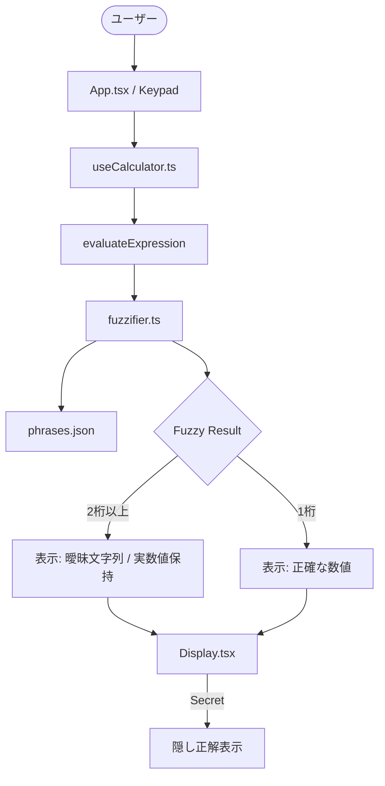

# Architecture - fuzzy-calc Update

## 技術スタック
- **Frontend**: React Native / Expo
- **Logic**: TypeScript
- **Styling**: StyleSheet (React Native)

## システム構成図

## データフロー
1. ユーザーが `=` を押下。
2. `useCalculator` が式を評価し、正確な結果を取得。
3. `fuzzifier` に正確な結果を渡し、表示用のテキストと実数値を含むオブジェクトを生成。
4. `Display` コンポーネントが受け取り、メイン領域にテキスト、隅に実数値を表示。
